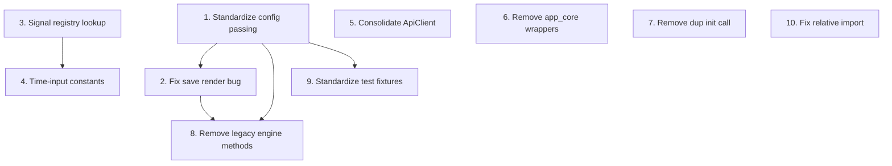

# Post-Refactor Consolidation and Cleanup

## Context

After the signal registry single-source-of-truth refactor and evolution subpackage restructuring, several inconsistencies and redundancies have become visible. The changes below are grouped from high to low impact.

---

## 1. Standardize Config Passing (Remove `engine` Dependency from Pure Functions)

**Problem:** Functions in `[serialization.py](src/eyecatcher/evolution/serialization.py)` and `[genome.py](src/eyecatcher/evolution/genome.py)` take `engine: CPPNEngine` just to access `.config` and `.time_config`, while the analogous functions in `[operators.py](src/eyecatcher/evolution/operators.py)` and `[rendering.py](src/eyecatcher/evolution/rendering.py)` take `(visual_config, time_config)` directly. This couples pure data-transformation functions to the engine unnecessarily.

**Change:** Make all dual-genome module functions accept `(visual_config, time_config)` directly, matching operators.py and rendering.py. Update `CPPNEngine` facade methods to pass them.

Files to change:

- `serialization.py`: `dual_genome_from_json(data, engine)` becomes `dual_genome_from_json(data, visual_config, time_config)`; same for `copy_dual_genome`
- `genome.py`: `create_random_dual_genome(engine, ...)` becomes `create_random_dual_genome(visual_config, time_config, ...)`
- `engine.py`: Update the facade methods that call these
- All call-sites in `stateless_api.py`, `server.py`, `breeding.py`, tests, and examples

This removes the `TYPE_CHECKING` import of `CPPNEngine` from serialization.py and genome.py entirely.

---

## 2. Fix Save Rendering Bug

**Problem:** In `[server.py` line 231](src/eyecatcher/server.py), `_save_dual_genome` calls:

```231:235:src/eyecatcher/server.py
img = engine.render_image(
    dual_genome.visual,
    resolution=DEFAULT_RENDER_RESOLUTION,
    time=DEFAULT_RENDER_TIME,
)
```

This renders only the visual CPPN with a fixed time, ignoring the time signal CPPN entirely. The saved PNG does not represent what the user sees in the browser.

**Fix:** Use `engine.render_dual_image(dual_genome, resolution=DEFAULT_RENDER_RESOLUTION)` so the time CPPN is applied.

---

## 3. Replace Signal-Type Conditionals with a Registry Lookup

**Problem:** `[serialization.py` `extract_network_data](src/eyecatcher/evolution/serialization.py)` (lines 208-249) has repeated if/else blocks:

```208:212:src/eyecatcher/evolution/serialization.py
input_label_list = (
    input_labels(TIME_INPUTS)
    if network_type == "time"
    else input_labels(VISUAL_INPUTS)
)
```

This pattern appears twice (inputs and outputs) and would grow with every new network type.

**Fix:** Add a `NETWORK_SIGNALS` mapping to `signals.py`:

```python
NETWORK_SIGNALS = {
    "visual": (VISUAL_INPUTS, VISUAL_OUTPUTS),
    "time": (TIME_INPUTS, TIME_OUTPUTS),
}
```

Then `extract_network_data` becomes:

```python
signals, outputs = NETWORK_SIGNALS[network_type]
input_label_list = input_labels(signals)
output_label_list = output_labels(outputs)
```

---

## 4. Make Time-Input Name Lookups into Constants

**Problem:** `[visual_time_input_name()](src/eyecatcher/evolution/signals.py)` (line 186) and `[time_cppn_time_input_name()](src/eyecatcher/evolution/signals.py)` (line 191) are functions that do a linear scan every call, but always return the same string (`"time"` and `"raw_time"` respectively).

**Fix:** Replace with module-level constants computed once at import time:

```python
VISUAL_TIME_INPUT_NAME: str = next(s.name for s in VISUAL_INPUTS if s.enable_key == "time")
TIME_CPPN_TIME_INPUT_NAME: str = TIME_INPUTS[0].name
```

Keep the functions as deprecated aliases for one release if needed, or just update the 4 call-sites in `query.py` and `rendering.py`.

---

## 5. Consolidate `ApiClient` Fetch Methods (JS)

**Problem:** In `[api_client.js](static/js/modules/api_client.js)`, the `compile`, `breed`, `random`, and `save` functions each duplicate the fetch-parse-error pattern that `apiFetch` (line 135) already encapsulates. Four copies of the same boilerplate.

**Fix:** Rewrite them to use `apiFetch` internally:

```javascript
async function compile(genomes, colorMode) {
    const payload = genomes.map(g => ({ ...g, clicks: 0 }));
    const body = { genomes: payload };
    if (colorMode === "hsv" || colorMode === "rgb") body.color_mode = colorMode;
    return apiFetch(_apiUrl + "/compile", {
        method: "POST",
        headers: { "Content-Type": "application/json" },
        body: JSON.stringify(body),
    }, "Compile failed");
}
```

Same pattern for `breed`, `random`, `save`. Each drops ~8 lines of duplicated error handling.

---

## 6. Remove Thin Wrappers in `app_core.js`

**Problem:** Two functions in `[app_core.js](static/js/modules/app_core.js)` are pure pass-throughs:

```121:126:static/js/modules/app_core.js
function setupPattern(canvas, shaderCode) {
    return (
        window.PatternRenderer &&
        window.PatternRenderer.setupPattern(canvas, shaderCode)
    );
}
```

```128:139:static/js/modules/app_core.js
function renderPattern(patternData, time, mouseSpd, mouseDist, inact) {
    if (window.PatternRenderer && window.ZoomSignals) {
        window.PatternRenderer.renderPattern(
            patternData,
            time,
            mouseSpd,
            mouseDist,
            inact,
            window.ZoomSignals.signalState
        );
    }
}
```

**Fix:** Inline the `PatternRenderer` calls at the 2-3 call sites within app_core.js (e.g. `openFullscreen`). Remove `setupPattern` and `renderPattern` from `window.AppCore` exports. `animation_loop.js` already calls `PatternRenderer.renderPattern` directly via the pattern list from `AppCore.getPatterns()`.

---

## 7. Remove Duplicate `_init_genealogy_db()` Call

**Problem:** `[server.py` line 72](src/eyecatcher/server.py) calls `_init_genealogy_db()`, but the function is already called at import time in `[genealogy_routes.py` line 87](src/eyecatcher/genealogy_routes.py) when `genealogy_bp` is created.

**Fix:** Remove the explicit call in `server.py` line 72. The import of `genealogy_bp` on line 40 already triggers it.

---

## 8. Clean Up Legacy Single-Genome Engine Methods

**Problem:** `[engine.py](src/eyecatcher/evolution/engine.py)` exposes `mutate_genome` (line 228), `crossover_genomes` (line 236), `save_genome` (line 211), and `load_genome` (line 223), all marked "legacy support". These single-genome methods are only used in one test (`test_create_random_genome_and_mutate` in `test_cppn_engine.py`) and nowhere in production.

**Fix:** Remove the four legacy methods from `CPPNEngine`. The underlying functions (`mutate_single_genome`, `crossover_single_genomes`) remain available as public functions in `operators.py` for anyone who needs them. Update the one test to call the functions directly.

Similarly, `render_image` and `render_animation_frames` (single-genome, non-dual) on the engine could be removed if not used externally -- BUT `render_image` IS used in `_save_dual_genome` (which is the bug from item 2). Once that's fixed to use `render_dual_image`, the single-genome render wrappers on the engine become unused too.

---

## 9. Standardize Test Fixtures

**Problem:** Tests inconsistently create engines -- some use the `cppn_engine` fixture from `[conftest.py](tests/conftest.py)`, others create `CPPNEngine()` manually.

**Fix:**

- Use the `cppn_engine` fixture everywhere instead of inline `engine = CPPNEngine()`
- Add a `random_dual_genome` fixture to `conftest.py` for the common `create_random_dual_genome(engine, genome_id=0)` call
- Update `test_cppn_engine.py` and `test_signal_registry.py` to use fixtures

---

## 10. Fix Relative Import in `stateless_api.py`

**Problem:** Line 135 of `[stateless_api.py](src/eyecatcher/stateless_api.py)` uses an absolute import inside the function:

```python
from eyecatcher.evolution.signals import TIME_INPUTS
```

**Fix:** Move to top-level relative import: `from .evolution.signals import TIME_INPUTS` alongside the other imports (line 12-23). This also removes the lazy-import overhead on every `/api/time-output` call.

---

## Dependency Graph of Changes

Changes are ordered so each builds naturally on the previous:




Items 3-7 and 10 are independent of each other and can be done in any order. Items 1 and 2 should come first as they affect the most files. Item 8 depends on 1 and 2. Item 9 should come last since it touches tests that may change with other items.