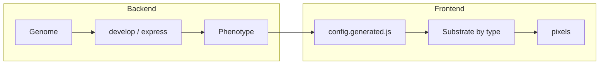

# Eyecatcher

[](https://github.com/KeithPatarroyo/eyecatcher/actions/workflows/ci.yml)
[](LICENSE)
[](https://www.python.org/downloads/)

Interactive evolution of patterns: NEAT-evolved patterns (CPPN, NCA) and Conway-style CA. Click to select favorites, evolve the next generation. Default representation is NCA (grid). For adding representations, signals, or changing config: [RESEARCHER_GUIDE.md](RESEARCHER_GUIDE.md).

## Quick Start

```bash
make docker-up
```

Then open **http://localhost:5001**. Common dev: **`make help`**, **`make test`**, **`make lint`**, **`make format`**.

## Running the project

### Docker (test the full stack)

- Install [Docker](https://docs.docker.com/get-docker/) and Docker Compose.
- From repo root: `make docker-up`. Open **http://localhost:5001** (compose maps host 5001 → 8080).
- Stop: `Ctrl+C` or `docker compose -f docker/docker-compose.yml down`.

Optional: copy [.env.example](.env.example) to `.env`; Docker Compose loads it. Community DB (`data/community.db`) is created on first run.

### Deploy to Railway

- Install [Railway CLI](https://docs.railway.app/develop/cli), `railway login`, then from repo root: `railway link` (first time).
- Set in dashboard: `ADMIN_KEY`, `CORS_ORIGINS`, optionally `DATABASE_PATH`. Do not set `PORT`.
- Deploy: `railway up`. Build uses [docker/Dockerfile](docker/Dockerfile); health checks use `/health`.

### Local Python (tests and dev server)

- Python 3.9+. From repo root: **`make install`** (venv, deps, pre-commit). Activate venv and run **`pre-commit install`**.
- Tests: `make test` or `pytest -m "not slow"`. Single file: `pytest tests/test_ca_substrate.py -v`.
- Dev server: `make dev` or `python -m eyecatcher.server`, then http://localhost:5001.

**Examples** (from repo root): `python examples/api_usage.py`, `python examples/evolution_batch.py`, `python examples/time_signal_showcase.py`.

## Architecture

The system follows a simple biological model:

- **Genome** — evolvable data (e.g. NEAT networks, grid). Created by `create_random`, evolved by `mutate` / `crossover`.
- **Development** — `express(genome)` produces a displayable output (image/grid); `develop(genome)` produces a GLSL **rule** for real-time rendering. Field substrates (CPPN) implement `develop`; grid (NCA, CA) use phenotype behaviour rules.
- **Phenotype** — declarative description: **Substrate** (field, grid, or image) and optional **Behaviour** (update/interaction rules for grids). The frontend picks a renderer by `phenotype.substrate.type`.
- **Sensory system** — each representation has a `sensory_system` (receptors + signals). Receptors bind signals to input targets (e.g. visual CPPN, time CPPN); the rule assembler uses them to build GLSL.



**API:** Stateless. Client stores genomes; sends them on `POST /api/develop`, `/api/express`, `/api/evolve`, `/api/save`. No server-side population. See [RESEARCHER_GUIDE.md](RESEARCHER_GUIDE.md) for the object model and where to edit.

## Project layout

- **src/eyecatcher/** — Python package. Entry: `server.py`. Top-level modules: `experiment.py` (config, presets), `data.py` (DB, genealogy). Packages: `representation/`, `signals/`, `genome/`, `evolution/`, `glsl/`, `inspection/`, `web/`.
- **static/** — Frontend (viewer, community, genealogy). [static/js/README.md](static/js/README.md) for folder map.
- **config/** — [config/neat/](config/neat/) (NEAT .txt files), [config/experiments.json](config/experiments.json) (presets), [config/evolution_defaults.json](config/evolution_defaults.json). Set `EXPERIMENT_CONFIG=preset_name` to switch experiment.
- **Root** — Makefile, pyproject.toml, docker/, scripts/, [.env.example](.env.example), eslint.config.js.
- **tests/** — Pytest. [tests/README.md](tests/README.md). Run `make test` or `pytest -m "not slow"`.
- **examples/** — [examples/README.md](examples/README.md). API usage, batch evolution, time-signal plot.
- **data/** — Community and genealogy DBs (gitignored). **output/** — saved patterns, frames (gitignored). Contributing: [.github/CONTRIBUTING.md](.github/CONTRIBUTING.md).

## Requirements

Python 3.9+. Dependencies in [pyproject.toml](pyproject.toml). Dev: `make install` (pytest, ruff, pre-commit, npm for JS lint).

## Contributing

See [.github/CONTRIBUTING.md](.github/CONTRIBUTING.md). AI agents: [.github/AGENTS.md](.github/AGENTS.md).

## License

MIT — see [LICENSE](LICENSE).
