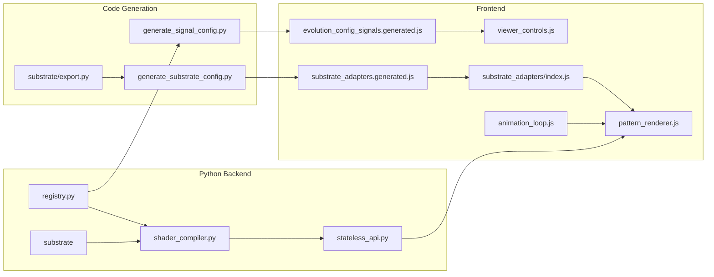

# Researcher guide

This guide points you to the files that matter for changing evolution behavior (signals, NEAT config, reproduction, rendering). The rest of the app (server, community, genealogy UI) you can mostly ignore for evolution-only work.

## How the backend is grouped

The Python package is under `src/eyecatcher/`. Main packages:

| Area | What it is | When you look here |
|------|------------|---------------------|
| **evolution/** | Config, get_configured_substrate, reproduction, operators. | Changing the evolution algorithm or NEAT config. |
| **genome/** | Generic NEAT genome (create_random_genome, JSON, copy). | Changing generic genome or wire serialization. |
| **substrate/** | Substrates (Single/Dual CPPN, CA), DualGenome, dual serialization. | Changing substrate types or dual-genome. |
| **signals/** | Input/output definitions. | Adding/changing signals. |
| **inspection/** | genome_visualizer, network_data (graph/stats for UI/API). | Changing network export, genome visualization, or graph/stats. |
| **glsl/** | Display pipeline: genome → GLSL. | Changing how genomes become shader code. |
| **web/** | Flask app, routes, stateless_api. | Adding endpoints or changing API. |
| **data/** | Genealogy DB and DB path/connection helpers (db_util). | Changing genealogy storage/export or fixing DB infra. |

Exact file tree and file-by-file roles: **[src/eyecatcher/README.md](src/eyecatcher/README.md)**.

## Where evolution logic lives

- **Public API:** Import from **eyecatcher.evolution** (config, get_configured_substrate, produce_next_generation), **eyecatcher.genome** (generic serialization), **eyecatcher.substrate** (DualGenome, get_substrate, substrates, dual serialization), **eyecatcher.signals**, **eyecatcher.inspection**, **eyecatcher.glsl** (ShaderCompiler).
- **Evolution** (config, reproduction, operators): **src/eyecatcher/evolution/**.
- **Genome (generic)** and **substrate (dual-genome, substrates):** **src/eyecatcher/genome/**, **src/eyecatcher/substrate/**; network graph/stats: **src/eyecatcher/inspection/network_data.py**.
- **Signals:** **src/eyecatcher/signals/**. **NEAT activation (e.g. cos):** **src/eyecatcher/genome/activation.py**.
- **Visualization and fitness:** **src/eyecatcher/inspection/** (genome_visualizer, network_data). **Fitness (batch):** **src/eyecatcher/evolution/fitness.py**.
- **Shader pipeline** (genome to GLSL): **src/eyecatcher/glsl/** (display only).
- **Genome bundle save/load:** substrate `build_save_assets` (e.g. dual_cppn); genealogy: **src/eyecatcher/data/genealogy_db.py**.
- **Entry point:** **server.py** at package root; uses evolution, substrate, glsl, etc. for compile, evolve, save, and query.

**API and genome format:** In the HTTP API (compile, evolve, save, genealogy), “genome” means the **substrate-specific individual JSON**: the shape depends on the active substrate (e.g. dual_cppn sends `{ "visual": {...}, "time_signal": {...} }`; CA sends `{ "rule": ..., "state": ... }`). The backend does not expose a single universal genome type; each substrate defines its own.

### Architecture map (data flow)



## Add or change a signal (input/output)

Signals are defined in Python only; the frontend config is generated from the registry.

**Checklist (order matters):** 1) Edit signals/registry.py → 2) Run make generate-signals → 3) Update NEAT num_inputs/num_outputs if counts changed → 4) Restart server and reload app.

1. **Edit the registry:** [src/eyecatcher/signals/registry.py](src/eyecatcher/signals/registry.py) – add or change entries in VISUAL_INPUTS, TIME_INPUTS, VISUAL_OUTPUTS, TIME_OUTPUTS. Use `Signal("id", "Label")` for inputs; use `Signal("id", "Label", is_spatial=True)` for per-pixel inputs (x, y, distance); use `Output("id", "Label")` for outputs.
2. **Generate frontend config:** Run `make generate-signals` (or `python scripts/generate_signal_config.py` from repo root). This writes [static/js/evolution/evolution_config_signals.generated.js](static/js/evolution/evolution_config_signals.generated.js) and validates NEAT config.
3. **NEAT counts:** If you added or removed inputs/outputs, update num_inputs/num_outputs in [config/neat/](config/neat/) (neat_config_experimental.txt, neat_config_time_experimental.txt). The generate script will fail with a clear message if they don’t match the registry.
4. Restart the server and reload the app.

If you forget step 2, the frontend will still use the old signal list until you run `make generate-signals`. The test `test_frontend_signals_match_backend` in [tests/test_signal_registry.py](tests/test_signal_registry.py) fails if the generated file does not match the Python registry; run `make test` to catch drift.

## Pluggable signal sources

The viewer (and community/genealogy previews) get CPPN input values—`raw_time`, `mouse_speed`, `mouse_dist`, `activity`—from a **signal source**. By default this is the built-in source (mouse + time from the animation loop). You can replace it with a custom source (e.g. fixed values for static previews, or future audio/gamepad).

**Interface:** A signal source is an object with `getValues(context)`. `context` is `{ canvas?: HTMLCanvasElement }` (optional; used for per-pattern `mouse_dist`). The function returns an object with keys matching the canonical signal ids (see `SIGNAL_IDS` in [evolution_config_signals.generated.js](static/js/evolution/evolution_config_signals.generated.js)); values should be in the **0–1** range.

**How to plug in:** Set `window.SignalSource` to your object **before** the app loads (e.g. in a script loaded before `app.js`), or pass `signalSource` into `AnimationLoop.init()` in [app.js](static/js/app/app.js). Example for fixed values (all patterns and previews use these):

```js
window.SignalSource = {
    getValues: function () {
        return { raw_time: 0.5, mouse_speed: 0, mouse_dist: 0, activity: 0 };
    },
};
```

**Where it’s used:** Main grid (animation loop), community preview, and genealogy thumbnails all use the same active source. The active source is whatever was set at `AnimationLoop.init()` (or `window.SignalSource` at load). Code that needs the current source can call `window.getSignalSource()` (set by the animation loop after init).

## Switch experiment (preset)

To run a different experiment without editing code, use **presets** in [config/experiments.json](config/experiments.json). Each preset sets NEAT config paths, population size, crossover probability, and substrate. Start the server with:

```bash
EXPERIMENT_CONFIG=experiment_b python -m eyecatcher.server
```

If `EXPERIMENT_CONFIG` is unset, the `"default"` preset is used (when the file exists). Add or edit presets in `config/experiments.json`; one restart per experiment.

**Important:** Changing `EXPERIMENT_CONFIG` (e.g. switching from dual_cppn to ca) requires a **full page reload** (or "New random population") so the client picks up the new substrate and config from `GET /api/config`. The bootstrap runs once at load; there is no in-page "reload config" action.

## Change NEAT config paths or population size

- **Evolution defaults** (population_size, max_population_size, crossover_probability, elitism_default): edit [config/evolution_defaults.json](config/evolution_defaults.json), then run `make generate` so the frontend gets the new fallbacks. Presets in [config/experiments.json](config/experiments.json) override these; set `EXPERIMENT_CONFIG` to the preset name to use it.
- **NEAT config paths** and render resolution: [src/eyecatcher/evolution/config.py](src/eyecatcher/evolution/config.py). Presets can set neat_config_path, neat_time_config_path.
- Config files live in [config/neat/](config/neat/); see config/neat/README.md. Gene-level mutation rates are in the NEAT .txt files. Population size for interactive evolution is **not** taken from NEAT `pop_size`; it comes from evolution_defaults.json / preset / UI. A startup warning is logged if they differ.

**Tweaking parameters at runtime (no restart):** Population size, max population size, and crossover probability can be changed from the **Settings** panel in the viewer (Experiment parameters). The UI calls `PATCH /api/config` with `{ population_size?, max_population_size?, crossover_probability? }`; the server applies an in-memory overlay used by `GET /api/config` and by the next evolve. Substrate and NEAT config paths still require restart or preset change.

## Breeding and selection

- [src/eyecatcher/evolution/reproduction.py](src/eyecatcher/evolution/reproduction.py) – `produce_next_generation()` (parent handling, elitism, mutation vs crossover). Called by the server's evolve endpoint.
- [src/eyecatcher/genome/operators.py](src/eyecatcher/genome/operators.py) – `mutate_genome`, `crossover_genomes` (generic NEAT). Dual-genome mutate/crossover: **src/eyecatcher/substrate/dual_genome.py**. Change selection or add tournament selection by editing reproduction.py and/or operators.

## Rendering and serialization

- **Rendering:** Substrates implement `render_to_image` (e.g. [substrate/cppn_base.py](src/eyecatcher/substrate/cppn_base.py), [substrate/dual_cppn.py](src/eyecatcher/substrate/dual_cppn.py)); used for save PNG and batch export.
- **Serialization:** [src/eyecatcher/genome/serialization.py](src/eyecatcher/genome/serialization.py) – genome_to_json, genome_from_json, copy_genome (generic). Dual-genome: substrate (dual_genome_to_json, dual_genome_from_json, copy_dual_genome). **Network graph/stats for UI/API:** [src/eyecatcher/inspection/network_data.py](src/eyecatcher/inspection/network_data.py) – extract_network_data, parse_network_node_id.

## GLSL / shader compilation (display pipeline)

Shaders are how we *display* evolved genomes, not part of the evolution algorithm. The pipeline lives in **glsl/**:

- **Phases:** Topology → node code → template. Implemented in [glsl/compiler_topology.py](src/eyecatcher/glsl/compiler_topology.py) (enabled connections, evaluation order), [glsl/node_code_generator.py](src/eyecatcher/glsl/node_code_generator.py) (genome → GLSL node computations), [glsl/glsl_fragments.py](src/eyecatcher/glsl/glsl_fragments.py) (activation GLSL strings), [glsl/shader_compiler.py](src/eyecatcher/glsl/shader_compiler.py) (orchestrates and builds the full shader).
- **Add an activation:** See checklist below.
- **Change output (color mode):** See "Add or change an output mode" below.
- **Change inputs/signals:** Edit [signals/registry.py](src/eyecatcher/signals/registry.py) (VISUAL_INPUTS, TIME_INPUTS, build_glsl_input_map); the compiler uses them automatically.

### Checklist: Add an activation

1. **CPU (query):** [src/eyecatcher/genome/activation.py](src/eyecatcher/genome/activation.py) – define the Python function and add it in `register_custom_activations()` (e.g. `activation_defs.add("myname", my_fn)`).
2. **GLSL string:** [src/eyecatcher/glsl/glsl_fragments.py](src/eyecatcher/glsl/glsl_fragments.py) – add the GLSL snippet for the activation (e.g. in `ACTIVATION_GLSL_BLOCK` or the dict that maps names to code).
3. **Name mapping:** [src/eyecatcher/glsl/node_code_generator.py](src/eyecatcher/glsl/node_code_generator.py) – add the name to `ACTIVATION_FUNCTIONS` so the compiler emits the correct GLSL function name.
4. **NEAT config:** In [config/neat/](config/neat/) (e.g. neat_config_experimental.txt), add the new name to `activation_options` (and optionally `activation_default`) so genomes can use it.
5. Restart the server and run `make generate-signals` if you changed anything that affects the signal/activation export.

### Add or change an output mode (color mode)

Output mode is how CPPN outputs (e.g. three floats) are turned into final RGB in the shader. Currently only **hsv** and **rgb** exist.

**Exact locations:**

- **Backend:** [src/eyecatcher/glsl/shader_compiler.py](src/eyecatcher/glsl/shader_compiler.py) – method `_get_color_output_code()`. Add a branch (e.g. `elif self.color_mode == "grayscale":`) and return the GLSL string that computes `fragColor` from `output_0`, `output_1`, `output_2`. The `ShaderCompiler` constructor accepts `color_mode`; pass it when creating the compiler (e.g. in substrates or API).
- **Frontend:** The toolbar or viewer controls that let users pick color mode (e.g. RGB vs HSV) are in the main viewer HTML/JS; if you add a new mode, add a radio option and pass the chosen value as `color_mode` in compile/save requests (see [static/js/lib/api_client.js](static/js/lib/api_client.js) `compile(genomes, colorMode)`).

To introduce a **registry** of output modes (name → GLSL function), you would refactor `_get_color_output_code()` to look up a dict of mode names to GLSL code strings; the frontend could then read available modes from config.

## Shader response (compile / save / export)

The same “shader + network stats” shape is used by the compile API, save bundle, and export:

- **Compile:** [src/eyecatcher/web/stateless_api.py](src/eyecatcher/web/stateless_api.py) – `_compile_genomes` builds each item via the substrate's `compile_to_shader` and `get_compile_stats`. Returns `{ "shaders": [ { "id", "shader", "clicks", "nodes", "connections", "visual_nodes", "visual_connections", "time_nodes", "time_connections" }, ... ] }`.
- **Save/export:** Same stats come from the substrate (e.g. dual_cppn's `get_compile_stats`, `build_save_assets`); stateless_api and save handler build the bundle (PNG, GLSL, genome JSON, optional network PDF).
- **Extending metadata:** Extend the dict built in stateless_api (or substrate `get_compile_stats` / save assets) so compile, save, and export expose new fields consistently.

## Data collection / genealogy

Genealogy stores evolutionary history (populations, individuals, branches) in SQLite:

- **Data layer:** [src/eyecatcher/data/genealogy_db.py](src/eyecatcher/data/genealogy_db.py) – DB init, `save_generation_result`, `save_population`, and pure query functions. No Flask; returns Python dicts/lists or genome objects.
- **Routes:** [web/genealogy_routes.py](src/eyecatcher/web/genealogy_routes.py) – thin HTTP wrappers: parse request, call genealogy_db, jsonify.
- **Extending metadata:** The `populations.metadata_json` column stores arbitrary JSON. Pass `metadata={...}` to `save_population` or `save_generation_result` (e.g. experiment_id, config_hash, selection method) for reproducibility; export includes it.
- **Experiment config auto-log:** Every genealogy save (evolve auto-save and save-population) records an `experiment_config` snapshot in metadata (substrate_id, population_size, crossover_probability). **GET /api/experiment-log** returns recent entries (JSON by default; `?format=csv` for CSV download). Use for reproducibility and analysis.
- **Custom export:** Export format is the dict returned by `export_genealogy_data`. To add another format (e.g. CSV of fitness over time), add a function in genealogy_db and a route that calls it.

## Frontend extension points

The viewer frontend is grouped by role; see **[static/js/README.md](static/js/README.md)** for the full layout.

- **evolution/** — Where the experiment lives (signals, reproduction, rendering). Edit when you change how evolution or the viewer behaves: [evolution_config.js](static/js/evolution/evolution_config.js), [evolution_coordinator.js](static/js/evolution/evolution_coordinator.js), [pattern_renderer.js](static/js/evolution/pattern_renderer.js), [viewer_controls.js](static/js/evolution/viewer_controls.js).
- **app/** — Application shell (state, grid, fullscreen, genealogy sync, animation loop). Edit when you change app structure or flow: [app.js](static/js/app/app.js), [population_state.js](static/js/app/population_state.js), etc.
- **lib/** — Infrastructure (API client, utils, toast, storage). Only touch for bugs or app-wide support.
- **features/** — Optional features (population UI, community, network viz, toolbar, genealogy viewer). Edit when you care about that feature.

[static/js/app/app.js](static/js/app/app.js) wires everything and passes state + actions to the feature modules.

## Frontend rendering architecture

This section describes how patterns get rendered to the screen. Read this before writing a custom substrate adapter or adding new interaction modes. For the full frontend file layout, see **[static/js/README.md](static/js/README.md)**.

### Data flow

```
Python substrate.compile_to_shader()
        ↓
    GLSL string (fragment shader)
        ↓
Frontend: PatternRenderer.setupPattern(canvas, glsl) → { gl, program, positionBuffer }
        ↓
Each frame (animation_loop.js):
    SignalSource.getValues(canvas) → signal values → adapter.buildUniforms() → uniform dict
        ↓
    adapter.render(patternData, uniforms, signalState) → gl.drawArrays → pixels
```

### Key concepts

- **One canvas per pattern.** Each pattern card has its own `<canvas>` with its own WebGL 2 context, shader program, and position buffer. Stored in `patternsMap` (id → `{ canvas, gl, program, positionBuffer, clicks }`).
- **Stateless by default.** Each frame draws from scratch using uniforms. There are no framebuffer objects (FBOs) in the default pipeline, but helpers exist for adapters that need them (see below).
- **Vertex shader is fixed.** All substrates use the same fullscreen-quad vertex shader (positions `[-1,-1, 1,-1, -1,1, 1,1]` → `TRIANGLE_STRIP`). The fragment shader is substrate-specific.
- **Adapters own rendering.** The `adapter.render()` method has full access to `gl` and `program`; it can set any uniform type, bind textures, and do multi-pass rendering.

### Substrate adapter interface

Custom substrates register a JS adapter (see [static/js/evolution/substrate_adapters/](static/js/evolution/substrate_adapters/)). The adapter interface (all methods except `render` are optional):

| Method | Required | Purpose |
|--------|----------|---------|
| `id` | Yes | Substrate identifier (must match Python `substrate.id`) |
| `outputType` | Yes | `"shader"` or `"grid"` |
| `render(patternData, uniformValues, signalState)` | Yes | Draw one frame |
| `isGenomeFormat(obj)` | Yes | Return `true` if a genome object matches this substrate |
| `buildUniforms(signalValues)` | No | Convert signal ids to uniform names |
| `preparePatternData(patternData, pattern)` | No | Store substrate-specific fields on patternData |
| `hasSignalControls` | No | Show signal toggle checkboxes (default: `false`) |
| `capabilities` | No | `{ save, network, timeOutput, adjustWeight }` |
| `getMetaLabel(pattern)` | No | Custom label for the pattern card info |
| `onSetup(patternData, gl)` | No | Called once after WebGL setup (create FBOs, textures) |
| `onBeforeRender(patternData, context)` | No | Called before each frame (read neighbor state) |
| `onAfterRender(patternData, context)` | No | Called after each frame (write edge state, swap FBOs) |
| `onTeardown(patternData, gl)` | No | Called on pattern removal (cleanup FBOs, textures) |
| `onCellInteraction(patternData, x, y, type)` | No | Called on pixel-level click (x, y in 0–1; type is `"click"` or `"contextmenu"`) |

See [ca.js](static/js/evolution/substrate_adapters/ca.js) for a minimal custom adapter and [cppn_adapter.js](static/js/evolution/substrate_adapters/cppn_adapter.js) for the config-driven CPPN adapter.

**Substrate playground:** For rapid shader iteration without the full evolution UI, open [static/substrate_playground.html](static/substrate_playground.html) (e.g. `http://localhost:5001/substrate_playground.html` when the server is running). Edit the fragment shader in the textarea, use sliders for uniforms, and click the canvas to see normalized coordinates.

### Substrate capabilities matrix

What the rendering pipeline supports today and where to add missing capabilities:

| Capability | Supported | Where to add / how to use |
|---|---|---|
| Stateless shader rendering | Yes | Existing adapter system; substrate returns GLSL from `compile_to_shader()` |
| Stateful (FBO) rendering | Yes | Use `PatternRenderer.createFBO()` in `adapter.onSetup()`; ping-pong in `render()` |
| Scalar uniform inputs | Yes | Signal system + `adapter.buildUniforms()` |
| Texture uniform inputs | Partial | Bind FBO textures in `adapter.render()`; no general texture upload API yet |
| Per-pixel click interaction | Yes | Use `PatternRenderer.getClickCoordinates(event, canvas)` and `adapter.onCellInteraction()` |
| Cross-pattern communication | Yes | `GridTopology.getNeighbors(id)` + lifecycle hooks (`onBeforeRender` / `onAfterRender`) |
| Multi-pass rendering | Partial | Adapters can do multiple draw calls in `render()` using FBOs |
| Custom vertex shader | No | Hard-coded fullscreen quad in `pattern_renderer.js`; modify `VERTEX_SHADER_SOURCE` if needed |
| Compute shaders | No | Would require adding WebGL 2 compute or using transform feedback |

## What you can ignore for evolution-only work

- **Server and routes:** server.py, web/ (stateless_api, genealogy_routes, community_routes) – HTTP and DB; they call evolution (reproduction), genome/substrate (serialization), glsl (compile), and data (genealogy_db).
- **Frontend:** static/ – pattern renderer, viewer controls, and evolution_config.js matter for signals and UI; the rest (community UI, genealogy viewer, storage) is optional for "just evolution."
- **Data and config:** data/ (DBs), config/neat/ (file contents matter; paths set in evolution/config.py).

## Keeping frontend in sync

Some constants exist in both Python and JavaScript; when you change them, update both sides. Default dev port: Python uses [server.py](src/eyecatcher/server.py) (`DEFAULT_PORT`); frontend uses [static/js/evolution/evolution_config.js](static/js/evolution/evolution_config.js) (`DEFAULT_DEV_PORT`). **Evolution defaults** (population size, max, crossover, etc.): single source is [config/evolution_defaults.json](config/evolution_defaults.json); backend loads it, and `make generate-evolution-config` (or `make generate`) produces [evolution_config_defaults.generated.js](static/js/evolution/evolution_config_defaults.generated.js) for frontend fallbacks. Population size and max are bootstrapped from `GET /api/config` at load time. **Signal toggles and outputs** come from the Python registry: run `make generate-signals` after changing [signals/registry.py](src/eyecatcher/signals/registry.py). **Substrate adapter config** (ids, genome format) is generated from [substrate/export.py](src/eyecatcher/substrate/export.py): run `make generate-substrates` after adding or changing substrates. Run `make generate` to run all codegen. test_signal_registry checks that the generated signals file matches the registry.

**Evolution config vs NEAT:** Substrate-agnostic evolution params (population_size, crossover_probability, elitism_default) live in [config/evolution_defaults.json](config/evolution_defaults.json); presets in [config/experiments.json](config/experiments.json) override them. NEAT config paths and NEAT .txt file contents (mutation rates, pop_size in .txt, etc.) stay in [evolution/config.py](src/eyecatcher/evolution/config.py) and config/neat/; population size for interactive evolution is controlled by our config, not by NEAT `pop_size`. At startup, a warning is logged if NEAT `pop_size` differs from our effective population_size.

## Add a new substrate

Substrates (dual_cppn, ca, future NCA/single_cppn) share a common protocol. **Single source of truth:** the substrate class defines its own `frontend_metadata`; the registry is the only other place you add the new substrate. No separate metadata file.

1. **Python – substrate class:** Add a new module under `src/eyecatcher/substrate/` (e.g. `ca.py`, `dual_cppn.py`) implementing the `Substrate` protocol: `id`, `output_type`, `create_random`, `mutate`, `crossover`, `evaluate`, `compile_to_shader`, `to_json`, `from_json`. **On the class, set `frontend_metadata`** (dict with `hasSignalControls`, `genomeKeys`, `capabilities`, and optionally `excludeKeys`). See [substrate/protocol.py](src/eyecatcher/substrate/protocol.py) and [substrate/ca.py](src/eyecatcher/substrate/ca.py) or [substrate/dual_cppn.py](src/eyecatcher/substrate/dual_cppn.py) for examples.
2. **Python – register:** In [substrate/__init__.py](src/eyecatcher/substrate/__init__.py), export the new class. In [substrate/registry.py](src/eyecatcher/substrate/registry.py), add one line to the `SUBSTRATES` dict. [substrate/export.py](src/eyecatcher/substrate/export.py) reads metadata from each class (`frontend_metadata`); you do not edit export.py. Then run `make generate-substrates`.
3. **Config – preset:** In [config/experiments.json](config/experiments.json), add a preset with `"substrate": "<id>"` and any substrate-specific kwargs (e.g. `width`, `generations` for CA).
4. **Frontend – display:** If the substrate needs custom rendering (e.g. special uniforms like CA’s `uRule`, `uGeneration`), update [static/js/evolution/pattern_renderer.js](static/js/evolution/pattern_renderer.js) to branch on the pattern shape or `output_type` (e.g. `pattern.rule`, `patternData.caRule`). For CPPN variants, rendering is driven by SIGNAL_TOGGLES; no new branch needed.
5. **Frontend – load/add:** [app.js](static/js/app/app.js) `loadFromStatelessGenomes` branches on `outputType` (grid → evaluate, shader → compile). Ensure `addToGrid` and load-from-saved flows receive `output_type`/`substrate_id` so they use evaluate for grid substrates and compile for shader substrates.
6. **Frontend – import:** [population_ui.js](static/js/features/population_ui.js) `handleImportFile` must recognise the new genome format (e.g. `genome.visual && genome.time_signal` for dual_cppn, `genome.rule` for CA). Add a branch or use a substrate adapter so imported genomes are accepted and the correct `output_type` is used.
7. **API:** See [substrate/API_REQUIREMENTS.md](src/eyecatcher/substrate/API_REQUIREMENTS.md) for which endpoints require which substrate capabilities. Compile and save work for dual_cppn, single_cppn, and ca; network and time-output are dual_cppn-only. Implement `get_capabilities()` on your substrate to declare which features are supported.

**Adapter split (config-driven vs custom):**

- **Config-driven substrates** (dual_cppn, single_cppn): No custom JS render code. They are registered from `SubstrateAdapterConfig` (generated from each substrate’s `frontend_metadata` via [substrate/export.py](src/eyecatcher/substrate/export.py)) using the shared [cppn_adapter.js](static/js/evolution/substrate_adapters/cppn_adapter.js). Adding a new CPPN variant = add a substrate class with `frontend_metadata`, register in registry.py; run `make generate-substrates`; no new adapter file.
- **Custom substrates** (ca, future NCA): Need a JS adapter file under [static/js/evolution/substrate_adapters/](static/js/evolution/substrate_adapters/) (e.g. [ca.js](static/js/evolution/substrate_adapters/ca.js)) that implements at least `id`, `outputType`, `isGenomeFormat`, `preparePatternData` (if the pattern needs extra fields for WebGL), and `render`. Put tunables (e.g. animation speed, grid size) at the top of the file. Register the adapter in that file with `SubstrateAdapters.register(adapter)`. The adapter is loaded after [index.js](static/js/evolution/substrate_adapters/index.js); config-driven adapters are registered from generated config, then ca.js registers the CA adapter (overwriting the config-driven CA entry if both exist). For a new custom substrate, add a new file (e.g. `nca.js`) and load it in [interactive_viewer.html](static/interactive_viewer.html) after the other adapter scripts.

Once substrate frontend adapters are in place, adding a new substrate will mostly be: Python substrate + registry + preset + one frontend adapter file (or config for CPPN variants).

## Batch evolution (substrate-agnostic)

The batch example uses the configured substrate from `EXPERIMENT_CONFIG` and supports pluggable fitness:

```bash
python examples/evolution_batch.py --fitness combined
EXPERIMENT_CONFIG=ca python examples/evolution_batch.py --fitness ca_symmetry
EXPERIMENT_CONFIG=single python examples/evolution_batch.py --fitness color_variance
```

- **Fitness registry:** [evolution/fitness.py](src/eyecatcher/evolution/fitness.py) – `register_fitness`, `get_fitness`, `list_fitness`. Built-in: `color_variance`, `temporal_variance`, `combined`, `ca_symmetry`.
- **Add a fitness:** Use `@register_fitness("name")` decorator; function receives `(individual, substrate)` and returns float.

## Quick reference

| I want to… | File(s) |
|------------|---------|
| Add a new substrate | substrate/ (new module with frontend_metadata, protocol), substrate/registry.py, config/experiments.json; make generate-substrates; frontend adapter if custom (see “Add a new substrate” above) |
| Add/rename a signal | signals/registry.py, then make generate-signals; update NEAT num_inputs/num_outputs if counts changed |
| Change population size or crossover (evolution defaults) | config/evolution_defaults.json, then `make generate`; preset overrides in config/experiments.json |
| Change NEAT config paths or render resolution | [evolution/config.py](src/eyecatcher/evolution/config.py) |
| Change reproduction/selection | evolution/reproduction.py, evolution/operators.py |
| Change CPU rendering or substrate query | substrate (e.g. cppn_base.evaluate, dual_cppn, ca) |
| Change how CPPN becomes GLSL | glsl/shader_compiler.py, glsl/glsl_fragments.py, glsl/node_code_generator.py, glsl/compiler_topology.py |
| Change compile/save/export response shape | web/stateless_api.py, substrate get_compile_stats / build_save_assets |
| Change genealogy storage or export | data/genealogy_db.py |
| Change wire serialization | genome/serialization.py, substrate to_json/from_json |
| Change network graph/stats for API or viz | inspection/network_data.py |
| Change genome file save/load (bundle pickle etc.) | substrate build_save_assets (e.g. dual_cppn) |
| Add/extend batch fitness | evolution/fitness.py |
| Run batch evolution with substrate | examples/evolution_batch.py (uses EXPERIMENT_CONFIG) |

For full project layout and running the app, see [README.md](README.md). For contributing (tests, style), see [.github/CONTRIBUTING.md](.github/CONTRIBUTING.md).
