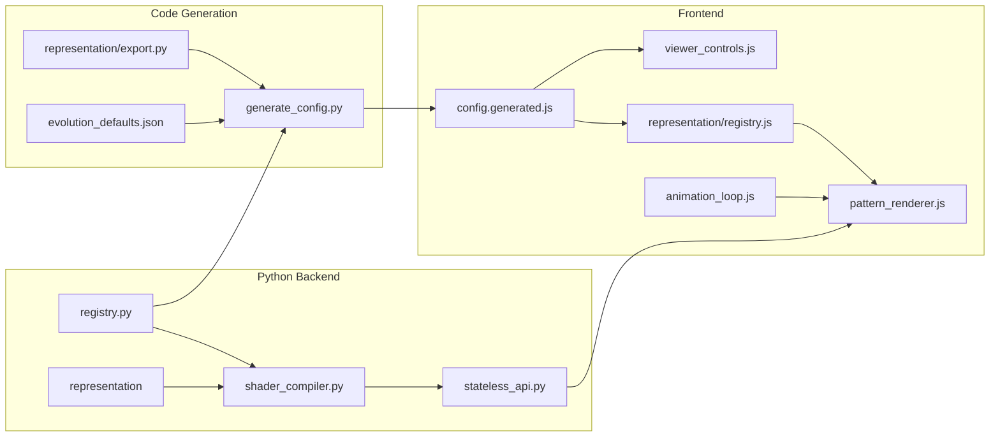

# Researcher guide

This guide points you to the files that matter for changing evolution behavior (signals, NEAT config, reproduction, rendering). The rest of the app (server, community, genealogy UI) you can mostly ignore for evolution-only work.

**Quick index:** [START_HERE.md](START_HERE.md) — one sentence per task (run experiment, change representation, add signal, add fitness, config) with links into this guide.

## Backend layout and where to edit

Python package: `src/eyecatcher/`. File tree: **[src/eyecatcher/README.md](src/eyecatcher/README.md)**.

| Area | What it is | When you look here |
|------|------------|---------------------|
| **evolution/** | Reproduction, fitness. | Evolution algorithm, NEAT config. |
| **experiment/** | Config, presets, get_configured_representation. | Experiment preset or population config. |
| **genome/** | Generic NEAT genome and DualGenome (JSON, copy). | Generic genome or wire serialization. |
| **representation/** | Representations (Single/Dual CPPN, CA), protocol. | Representation types or dual-genome. |
| **signals/** | Input/output definitions (catalog, sockets). | Adding/changing signals. Architecture: [signals/README.md](src/eyecatcher/signals/README.md). |
| **inspection/** | genome_visualizer, network_data. | Network export, genome visualization. |
| **glsl/** | Genome → GLSL. | How genomes become shader code. |
| **web/** | Flask app, stateless_api, routes. | Endpoints or API shape. |
| **data/** | Genealogy DB, db_util. | Genealogy storage/export. |

**Imports:** `eyecatcher.experiment` (get_configured_representation), `eyecatcher.evolution` (produce_next_generation, fitness), `eyecatcher.representation` (get_representation), `eyecatcher.genome`, `eyecatcher.signals`, `eyecatcher.glsl` (ShaderCompiler). **API genome format:** Request/response “genome” is representation-specific JSON (e.g. dual_cppn: `{ "visual", "time_signal" }`; CA: `{ "rule", "state" }`).

## Logical objects you work with

The system is built around a small set of concepts. The representation owns evolution and delegates expression to sockets; individuals are representation-specific; fitness and the API use the representation interface only.

| Object | What it is | Where it lives |
|--------|------------|----------------|
| **Experiment preset** | Named config: which representation, NEAT paths, population_size, crossover_probability, etc. | [config/experiments.json](config/experiments.json); env `EXPERIMENT_CONFIG` |
| **Representation** | The evolvable model type + instance. Defines individual type, expression (via sockets), and evolution (population, mutate, crossover). | [representation/](src/eyecatcher/representation/); `get_representation(id)` or `get_configured_representation()` |
| **Individual** | One evolved instance (in memory). Type is representation-specific (e.g. DualGenome, ConwayGenome). | Created by `representation.create_random` / `mutate` / `crossover` |
| **Population** | A list of individuals (or their JSON form). One generation. | Evolved by `produce_next_generation(representation, parents_data, ...)` |
| **SignalSpec** | Declares what a representation accepts (inputs, derived) and produces (outputs). Socket-centric: built from sockets. | `representation.signal_spec` |
| **Socket** | Binds signals to one input target (e.g. one NEAT network or grid). Expression only: query, stats, PDF. | Representation holds sockets (e.g. `rep.visual`, `rep.time`); base in [signals/socket.py](src/eyecatcher/signals/socket.py), NEAT/grid in [representation/sockets.py](src/eyecatcher/representation/sockets.py) |
| **Fitness** | Function(individual, representation) → float. Uses representation.sample_rgb, express, signal_spec. | [evolution/fitness.py](src/eyecatcher/evolution/fitness.py) |

**Terminology:** **Individual** = in-memory instance (DualGenome, DefaultGenome, ConwayGenome, etc.). **Genome** = representation-specific JSON payload (the serialized form of an individual). In the API, request/response bodies use genome (JSON); the protocol and fitness use “individual” for the in-memory object.

In practice you work with: **preset → representation → individuals and populations**, with **signals/sockets** as the representation’s interface and **fitness** as the bridge between individual and representation.

**API:** Request/response "genome" is representation-specific JSON (see Logical objects above).

### Conceptual model (phenotype and substrate)

The architecture maps to evolutionary biology: **genome** (evolvable data) undergoes **development** (`express()`, `develop()`) to produce a **phenotype** (declarative description). The phenotype is expressed on a **substrate** (shader, grid, or image—frontend framework code) and responds to the **environment** (signals: time, mouse, activity). When you add a representation you set `phenotype = Phenotype(substrate="shader")` (or `"grid"` / `"image"`); no JavaScript is required for standard substrates.

### Architecture map (data flow)



## Add or change a signal (input/output)

Architecture (spec, sockets, catalog): [signals/README.md](src/eyecatcher/signals/README.md).

**Single source of truth:** Catalog + representation sockets. Add a signal = add to catalog (and socket preset if needed) → run `make generate`. The codegen updates NEAT num_inputs/num_outputs from the representation and writes the frontend signal list; no manual NEAT edit.

**Checklist (order matters):** 1) Edit [signals/catalog.py](src/eyecatcher/signals/catalog.py) (and representation sockets if you add a new input target) → 2) Run `make generate` → 3) Restart server and reload app.

1. **Edit the catalog and representations:** [src/eyecatcher/signals/catalog.py](src/eyecatcher/signals/catalog.py) – add or change `Signal` or `Output` instances and presets (e.g. `DUAL_CPPN_VISUAL_INPUTS`, `DUAL_CPPN_TIME_INPUTS`). Use `Signal("id", "Label")` for inputs; use `Signal("id", "Label", is_spatial=True)` for per-pixel inputs (x, y, distance); use `Output("id", "Label")` for outputs. Representations (e.g. [representation/dual_cppn.py](src/eyecatcher/representation/dual_cppn.py)) build sockets from these presets; if you add a new input target, add a socket that uses the new list. The registry ([signals/registry.py](src/eyecatcher/signals/registry.py)) provides helpers like `export_for_frontend` and `parse_time_inputs`; it does not define the signal lists.
2. **Run codegen:** Run `make generate`. This writes [static/js/config.generated.js](static/js/config.generated.js) (representations, signals, defaults), updates HTML includes, and runs `generate-neat` to sync NEAT num_inputs/num_outputs from the catalog. No manual edit of [config/neat/](config/neat/) needed.
3. Restart the server and reload the app.

If you forget step 2, the frontend will still use the old signal list until you run `make generate`. The test `test_generated_signals_file_is_up_to_date` in [tests/test_signal_registry.py](tests/test_signal_registry.py) fails if the generated file does not match the current representation spec; run `make test` to catch drift.

## Pluggable signal sources

The viewer (and community/genealogy previews) get CPPN input values—`raw_time`, `mouse_speed`, `mouse_dist`, `activity`—from a **signal source**. By default this is the built-in source (mouse + time from the animation loop). You can replace it with a custom source (e.g. fixed values for static previews, or future audio/gamepad).

**Interface:** A signal source is an object with `getValues(context)`. `context` is `{ canvas?: HTMLCanvasElement }` (optional; used for per-pattern `mouse_dist`). The function returns an object with keys matching the canonical signal ids (see `SIGNAL_IDS` in `window.EyecatcherConfig.signals` from [config.generated.js](static/js/config.generated.js)); values should be in the **0–1** range.

**How to plug in:** Set `window.SignalSource` to your object **before** the app loads (e.g. in a script loaded before `app.js`), or pass `signalSource` into `AnimationLoop.init()` in [app.js](static/js/app/app.js). Example for fixed values (all patterns and previews use these):

```js
window.SignalSource = {
    getValues: function () {
        return { raw_time: 0.5, mouse_speed: 0, mouse_dist: 0, activity: 0 };
    },
};
```

**Where it’s used:** Main grid (animation loop), community preview, and genealogy thumbnails all use the same active source. The active source is whatever was set at `AnimationLoop.init()` (or `window.SignalSource` at load). Code that needs the current source can call `window.getSignalSource()` (set by the animation loop after init).

## Switch experiment (preset)

To run a different experiment without editing code, use **presets** in [config/experiments.json](config/experiments.json). Each preset sets NEAT config paths, population size, crossover probability, and representation. Start the server with:

```bash
EXPERIMENT_CONFIG=experiment_b python -m eyecatcher.server
```

If `EXPERIMENT_CONFIG` is unset, the `"default"` preset is used (when the file exists). Add or edit presets in `config/experiments.json`; one restart per experiment.

**Important:** Changing `EXPERIMENT_CONFIG` (e.g. switching from dual_cppn to ca) requires a **full page reload** (or "New random population") so the client picks up the new representation and config from `GET /api/config`. The bootstrap runs once at load; there is no in-page "reload config" action.

## Change NEAT config paths or population size

- **Evolution defaults** (population_size, max_population_size, crossover_probability, elitism_default): edit [config/evolution_defaults.json](config/evolution_defaults.json), then run `make generate` so the frontend gets the new fallbacks. Presets in [config/experiments.json](config/experiments.json) override these; set `EXPERIMENT_CONFIG` to the preset name to use it.
- **NEAT config paths** and render resolution: [src/eyecatcher/evolution/config.py](src/eyecatcher/evolution/config.py). Presets can set neat_config_path, neat_time_config_path.
- Config files live in [config/neat/](config/neat/); see config/neat/README.md. Gene-level mutation rates are in the NEAT .txt files. Population size for interactive evolution is **not** taken from NEAT `pop_size`; it comes from evolution_defaults.json / preset / UI. A startup warning is logged if they differ.

**Tweaking parameters at runtime (no restart):** Population size, max population size, and crossover probability can be changed from the **Settings** panel in the viewer (Experiment parameters). The UI calls `PATCH /api/config` with `{ population_size?, max_population_size?, crossover_probability? }`; the server applies an in-memory overlay used by `GET /api/config` and by the next evolve. Representation and NEAT config paths still require restart or preset change.

## Breeding and selection

- [src/eyecatcher/evolution/reproduction.py](src/eyecatcher/evolution/reproduction.py) – `produce_next_generation()` (parent handling, elitism, mutation vs crossover). Called by the server's evolve endpoint.
- [src/eyecatcher/genome/operators.py](src/eyecatcher/genome/operators.py) – `mutate_genome`, `crossover_genomes` (generic NEAT). Dual-genome mutate/crossover: **src/eyecatcher/genome/dual.py**. Change selection or add tournament selection by editing reproduction.py and/or operators.

## Rendering and serialization

- **Rendering:** Representations implement `render_to_image` (e.g. [representation/cppn_base.py](src/eyecatcher/representation/cppn_base.py), [representation/dual_cppn.py](src/eyecatcher/representation/dual_cppn.py)); used for save PNG and batch export.
- **Serialization:** [src/eyecatcher/genome/serialization.py](src/eyecatcher/genome/serialization.py) – genome_to_json, genome_from_json (generic). Dual-genome: [genome/dual.py](src/eyecatcher/genome/dual.py) (dual_genome_to_json, dual_genome_from_json). **Network graph/stats for UI/API:** [src/eyecatcher/inspection/network_data.py](src/eyecatcher/inspection/network_data.py) – extract_network_data, parse_network_node_id.

## GLSL / shader compilation (display pipeline)

Shaders are how we *display* evolved genomes, not part of the evolution algorithm. The pipeline lives in **glsl/**:

- **Phases:** Topology → node code → template. Implemented in [glsl/shader_compiler.py](src/eyecatcher/glsl/shader_compiler.py) (orchestrates: enabled connections, evaluation order, genome → GLSL node computations, full shader build) and [glsl/glsl_fragments.py](src/eyecatcher/glsl/glsl_fragments.py) (activation GLSL strings).
- **Add an activation:** See checklist below.
- **Change output (color mode):** See "Add or change an output mode" below.
- **Change inputs/signals:** Edit [signals/catalog.py](src/eyecatcher/signals/catalog.py) and representation sockets; the compiler uses the representation’s signal spec (see “Add or change a signal” above).

### Checklist: Add an activation

1. **CPU (query):** [src/eyecatcher/genome/activation.py](src/eyecatcher/genome/activation.py) – define the Python function and add it in `register_custom_activations()` (e.g. `activation_defs.add("myname", my_fn)`).
2. **GLSL string:** [src/eyecatcher/glsl/glsl_fragments.py](src/eyecatcher/glsl/glsl_fragments.py) – add the GLSL snippet for the activation (e.g. in `ACTIVATION_GLSL_BLOCK` or the dict that maps names to code).
3. **Name mapping:** [src/eyecatcher/glsl/activation_registry.py](src/eyecatcher/glsl/activation_registry.py) and [shader_compiler.py](src/eyecatcher/glsl/shader_compiler.py) – ensure the activation is in the registry so the compiler emits the correct GLSL function name.
4. **NEAT config:** In [config/neat/](config/neat/) (e.g. neat_config_experimental.txt), add the new name to `activation_options` (and optionally `activation_default`) so genomes can use it.
5. Restart the server and run `make generate` if you changed anything that affects the signal/activation export.

### Add or change an output mode (color mode)

Output mode is how CPPN outputs (e.g. three floats) are turned into final RGB in the shader. Currently only **hsv** and **rgb** exist.

**Exact locations:**

- **Backend:** [src/eyecatcher/glsl/shader_compiler.py](src/eyecatcher/glsl/shader_compiler.py) – method `_get_color_output_code()`. Add a branch (e.g. `elif self.color_mode == "grayscale":`) and return the GLSL string that computes `fragColor` from `output_0`, `output_1`, `output_2`. The `ShaderCompiler` constructor accepts `color_mode`; pass it when creating the compiler (e.g. in representations or API).
- **Frontend:** The toolbar or viewer controls that let users pick color mode (e.g. RGB vs HSV) are in the main viewer HTML/JS; if you add a new mode, add a radio option and pass the chosen value as `color_mode` in develop/save requests (see [static/js/lib/api_client.js](static/js/lib/api_client.js) `develop(genomes, colorMode)`).

To introduce a **registry** of output modes (name → GLSL function), you would refactor `_get_color_output_code()` to look up a dict of mode names to GLSL code strings; the frontend could then read available modes from config.

## Shader response (develop / save / export)

The same “shader + network stats” shape is used by the develop API, save bundle, and export:

- **Develop:** [src/eyecatcher/web/stateless_api.py](src/eyecatcher/web/stateless_api.py) – Builds each item via the representation’s `develop` and `get_develop_stats`. Returns `{ "shaders": [ { "id", "shader", "fitness", "nodes", "connections", ... }, ... ] }`.
- **Save/export:** Same stats come from the representation (e.g. dual_cppn’s `get_develop_stats`, `build_save_assets`); stateless_api and save handler build the bundle (PNG, GLSL, genome JSON, optional network PDF).
- **Extending metadata:** Extend the dict built in stateless_api (or representation `get_develop_stats` / save assets) so develop, save, and export expose new fields consistently.

## Data collection / genealogy

Genealogy stores evolutionary history (populations, individuals, branches) in SQLite:

- **Data layer:** [src/eyecatcher/data/genealogy_db.py](src/eyecatcher/data/genealogy_db.py) – DB init, `save_generation_result`, `save_population`, and pure query functions. No Flask; returns Python dicts/lists or genome objects.
- **Routes:** [web/genealogy_routes.py](src/eyecatcher/web/genealogy_routes.py) – thin HTTP wrappers: parse request, call genealogy_db, jsonify.
- **Extending metadata:** The `populations.metadata_json` column stores arbitrary JSON. Pass `metadata={...}` to `save_population` or `save_generation_result` (e.g. experiment_id, config_hash, selection method) for reproducibility; export includes it.
- **Experiment config auto-log:** Every genealogy save (evolve auto-save and save-population) records an `experiment_config` snapshot in metadata (representation_id, population_size, crossover_probability). **GET /api/experiment-log** returns recent entries (JSON by default; `?format=csv` for CSV download). Use for reproducibility and analysis.
- **Custom export:** Export format is the dict returned by `export_genealogy_data`. To add another format (e.g. CSV of fitness over time), add a function in genealogy_db and a route that calls it.

## Frontend

**Layout and rendering:** [static/js/README.md](static/js/README.md) — folder map, script order, representation interface, capabilities matrix.

### Data flow (patterns to pixels)

```
Python representation.develop()
        ↓
    GLSL string (fragment shader)
        ↓
Frontend: PatternRenderer.setupPattern(canvas, glsl) → { gl, program, positionBuffer }
        ↓
Each frame (animation_loop.js):
    SignalSource.getValues(canvas) → signal values → substrate.buildParams() → params
        ↓
    substrate.render(state, params, signalState) → pixels
```

### Substrate contract (frontend)

Display is driven by **phenotype** (from the backend) and **substrates** (framework JS). The registry builds a representation record per config from `EyecatcherConfig.representations` and the substrate chosen by `phenotype.substrate`. Researchers do not implement representation JS for standard substrates.

**Contract in code:** [substrate.js](static/js/representation/substrate.js) defines the base `Substrate` with six methods; only `createDisplayElement` and `render` are required; others have no-op defaults.

| Method | Purpose |
|--------|---------|
| `createDisplayElement(phenotype, patternPayload)` | Create DOM element (canvas, img, etc.); return `{ element, state }`. |
| `setup(state, phenotype)` | Initialize resources (WebGL programs, FBOs). |
| `teardown(state)` | Clean up resources. |
| `buildParams(phenotype, signalValues)` | Map environment signals to substrate-specific params (e.g. uniforms). |
| `render(state, params, signalState)` | Render one frame or tick. |
| `handleInteraction(state, x, y, interactionType)` | Optional: handle click/drag (e.g. grid toggle/draw). |

**Built-in substrates:** [shader_substrate.js](static/js/representation/shader_substrate.js) (stateless GLSL), [grid_substrate.js](static/js/representation/grid_substrate.js) (FBO ping-pong, step/display/toggle from phenotype), [image_substrate.js](static/js/representation/image_substrate.js) (static image fallback). Registry: [substrate_registry.js](static/js/representation/substrate_registry.js); unknown `phenotype.substrate` falls back to ImageSubstrate. Full capabilities matrix: [static/js/README.md](static/js/README.md).

## What you can ignore for evolution-only work

- **Server and routes:** server.py, web/ (stateless_api, genealogy_routes, community_routes) – HTTP and DB; they call evolution (reproduction), genome/representation (serialization), glsl (develop), and data (genealogy_db).
- **Frontend:** static/ – pattern renderer, viewer controls, and evolution_config.js matter for signals and UI; the rest (community UI, genealogy viewer, storage) is optional for "just evolution."
- **Data and config:** data/ (DBs), config/neat/ (file contents matter; paths set in evolution/config.py).

## Keeping frontend in sync

Some constants exist in both Python and JavaScript; when you change them, update both sides. To verify generated files are up to date (e.g. in CI), run `make check-generate`; it exits with an error and tells you to run `make generate` if anything is stale. Default dev port: Python uses [server.py](src/eyecatcher/server.py) (`DEFAULT_PORT`); frontend uses [static/js/evolution/config.js](static/js/evolution/config.js) (`DEFAULT_DEV_PORT`). **Evolution defaults** (population size, max, crossover, etc.): single source is [config/evolution_defaults.json](config/evolution_defaults.json); `make generate` produces [static/js/config.generated.js](static/js/config.generated.js) with a `defaults` section for frontend fallbacks. Population size and max are bootstrapped from `GET /api/config` at load time. **Signal toggles, outputs, and representation config** (phenotype, ids, genome format) are all in the same generated file; run `make generate` after changing [signals/catalog.py](src/eyecatcher/signals/catalog.py), representation sockets, or [representation/export.py](src/eyecatcher/representation/export.py). test_signal_registry checks that the generated signals section matches the registry.

**Evolution config vs NEAT:** Representation-agnostic evolution params (population_size, crossover_probability, elitism_default) live in [config/evolution_defaults.json](config/evolution_defaults.json); presets in [config/experiments.json](config/experiments.json) override them. NEAT config paths and NEAT .txt file contents (mutation rates, pop_size in .txt, etc.) stay in [experiment/config.py](src/eyecatcher/experiment/config.py) and config/neat/; population size for interactive evolution is controlled by our config, not by NEAT `pop_size`. At startup, a warning is logged if NEAT `pop_size` differs from our effective population_size.

### Representation types

**NEAT (CPPN):** `dual_cppn`, `single_cppn` — evolved networks, develop to GLSL. **Non-NEAT:** `ca` (Conway’s Game of Life, grid + FBO); `trivial` (minimal template: one socket tying a signal to the “body part” that expresses it, one float genome → solid-color grid). Copy [trivial.py](src/eyecatcher/representation/trivial.py) for custom representations (e.g. audio); see [base.py](src/eyecatcher/representation/base.py) for the protocol and [ca.py](src/eyecatcher/representation/ca.py) for a full non-NEAT example.

## Add a new representation

Representations (dual_cppn, single_cppn, ca, trivial, future NCA) share a common protocol. **Single source of truth:** the representation class defines its own `frontend_metadata` and **phenotype** (which substrate to use and optional display/behaviour config). The registry is the only other place you add the new representation. No JavaScript is generated: the frontend uses the phenotype from config to choose a substrate (shader, grid, or image).

**Scaffold (recommended):** Run `make new-representation name=<name>` (name in snake_case, e.g. `my_rep`). This creates the Python stub (with a default `Phenotype(substrate="image")`), registry entry, and `__init__.py` export; it prints a preset snippet for [config/experiments.json](config/experiments.json). Then run `make generate` and implement the representation logic in the Python module. For `substrate="image"` implement `render_to_image()`; for `substrate="shader"` implement `develop()`; for `substrate="grid"` provide step/display shaders and grid config in the phenotype.

Use this checklist if you add a representation by hand (or to verify after scaffolding). One line per file or action.

### Backend (required for every new representation)

| # | File or action | One-line description |
|---|----------------|----------------------|
| 1 | [src/eyecatcher/representation/\<new\>.py](src/eyecatcher/representation/) | New module: implement protocol (`id`, `output_type`, `signal_spec`, `phenotype`, `create_random`, `mutate`, `crossover`, `express`, `to_json`, `from_json`) and `frontend_metadata` (`hasSignalControls`, `genomeKeys`). Set `phenotype = Phenotype(substrate="shader"|"grid"|"image", ...)`. Implement `develop` for shader representations; for grid, put step/display/toggle shaders and config on the phenotype; for image, implement `render_to_image()`. Optionally `serialize_output(output)` for `/api/express`. See [protocol.py](src/eyecatcher/representation/protocol.py), [trivial.py](src/eyecatcher/representation/trivial.py), [ca.py](src/eyecatcher/representation/ca.py), [dual_cppn.py](src/eyecatcher/representation/dual_cppn.py). |
| 2 | [src/eyecatcher/representation/__init__.py](src/eyecatcher/representation/__init__.py) | Export the new representation class (and genome if needed). |
| 3 | [src/eyecatcher/representation/registry.py](src/eyecatcher/representation/registry.py) | Add one entry to `REPRESENTATIONS` dict: `"<id>": NewRepresentation`. |
| 4 | `make generate` | Regenerate frontend config from `frontend_metadata` (writes [static/js/config.generated.js](static/js/config.generated.js) and representation includes). |

### Config

| # | File or action | One-line description |
|---|----------------|----------------------|
| 5 | [config/experiments.json](config/experiments.json) | Add a preset with `"representation": "<id>"` and any representation-specific kwargs. |

### Frontend – config-driven only (CPPN-like stateless shader)

If your representation uses an existing **substrate** (shader, grid, or image), you do **not** write any frontend code. Set `phenotype = Phenotype(substrate="shader")` (or `"grid"` / `"image"`) and run `make generate`; the registry and substrates handle display.

### Frontend – custom substrate (new medium only)

If your representation uses a **new medium** (e.g. audio, 3D) that has no built-in substrate yet:

| # | File or action | One-line description |
|---|----------------|----------------------|
| 6 | [static/js/representation/](static/js/representation/) | New substrate class extending `Substrate` in a new file (e.g. `audio_substrate.js`). Implement the six-method contract from [substrate.js](static/js/representation/substrate.js); register it in [substrate_registry.js](static/js/representation/substrate_registry.js) (e.g. `registerSubstrate("audio", new AudioSubstrate())`). |
| 7 | [scripts/generate_representation_includes.py](scripts/generate_representation_includes.py) | Add your script basename to `REPRESENTATION_SCRIPTS` in load order; run `make generate-representation-includes` (or `make generate`). |

### Frontend – app and import (only if behaviour differs)

| # | File or action | One-line description |
|---|----------------|----------------------|
| 8 | [static/js/app/app.js](static/js/app/app.js) | Only if load/add flow must branch on your representation: ensure `output_type`/`representation_id` is passed so grid uses express and shader uses develop. |
| 9 | [static/js/app/population_ui.js](static/js/app/population_ui.js) | Only if import must recognise your genome shape: ensure the representation's `isGenomeFormat` is in the resolution order, or add branch so imported individuals get correct `output_type`. |

### Optional

| # | File or action | One-line description |
|---|----------------|----------------------|
| 10 | [static/js/representation/pattern_renderer.js](static/js/representation/pattern_renderer.js) | Only if you need a representation-specific branch in card creation; metadata is normally driven by phenotype `meta_template` and substrate state. |
| 11 | [static/js/app/grid_renderer.js](static/js/app/grid_renderer.js) | Only if you need grid-specific behaviour (e.g. overlap metric) beyond what the grid substrate provides. |
| 12 | Tests | Add representation tests (e.g. [tests/test_ca_substrate.py](tests/test_ca_substrate.py), protocol compliance via [tests/representation_test_helpers.py](tests/representation_test_helpers.py)). |

**Summary:** Standard substrates (shader, grid, image) = steps 1–5, no frontend code. Custom substrate (new medium) = 1–7; steps 8–11 only when app/import behaviour must differ.

## Batch evolution (representation-agnostic)

The batch example uses the configured representation from `EXPERIMENT_CONFIG` and supports pluggable fitness:

```bash
python examples/evolution_batch.py --fitness combined
EXPERIMENT_CONFIG=ca python examples/evolution_batch.py --fitness ca_symmetry
EXPERIMENT_CONFIG=single python examples/evolution_batch.py --fitness color_variance
```

- **Fitness registry:** [evolution/fitness.py](src/eyecatcher/evolution/fitness.py) – `register_fitness`, `get_fitness`, `list_fitness`. Built-in: `color_variance`, `temporal_variance`, `combined`, `ca_symmetry`.
- **Add a fitness:** Use `@register_fitness("name")` decorator; function receives `(individual, representation)` and returns float.

## Quick reference

| I want to… | File(s) |
|------------|---------|
| Add a new representation | `make new-representation name=<name>` (scaffold), then fill in logic; or representation/ (module, registry, __init__), config/experiments.json, make generate; phenotype picks substrate (no JS for shader/grid/image); custom substrate only for new medium (see “Add a new representation” above) |
| Add/rename a signal | signals/catalog.py (and representation sockets if new input target), then make generate; NEAT counts updated by codegen |
| Change population size or crossover (evolution defaults) | config/evolution_defaults.json, then `make generate`; preset overrides in config/experiments.json |
| See effective config and where each value comes from | `python -m eyecatcher config --show` or GET `/api/config?provenance=1` |
| Change NEAT config paths or render resolution | [experiment/config.py](src/eyecatcher/experiment/config.py) |
| Change reproduction/selection | evolution/reproduction.py, genome/operators.py |
| Change CPU rendering or representation query | representation/ (e.g. cppn_base, dual_cppn, ca) |
| Change how CPPN becomes GLSL | glsl/shader_compiler.py, glsl/glsl_fragments.py |
| Change develop/save/export response shape | web/stateless_api.py, representation get_develop_stats / build_save_assets |
| Change genealogy storage or export | data/genealogy_db.py |
| Change wire serialization | genome/serialization.py, representation to_json/from_json |
| Change network graph/stats for API or viz | inspection/network_data.py |
| Change genome file save/load (bundle pickle etc.) | representation build_save_assets (e.g. dual_cppn) |
| Add/extend batch fitness | evolution/fitness.py |
| Run batch evolution with representation | examples/evolution_batch.py (uses EXPERIMENT_CONFIG) |

For full project layout and running the app, see [README.md](README.md). For contributing (tests, style), see [.github/CONTRIBUTING.md](.github/CONTRIBUTING.md).
