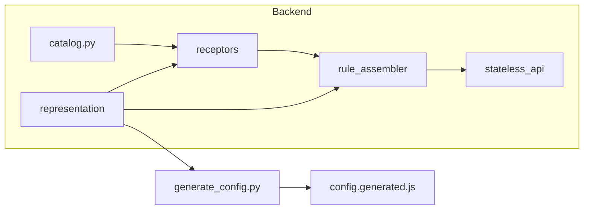

# Researcher guide

This guide explains the conceptual model and the main workflows. For running the app and project layout, see [README.md](README.md).

## Quick tasks

- **Run an experiment** — `make docker-up`, then http://localhost:5001. Local Python: [README.md#running-the-project](README.md#running-the-project).
- **Change representation or add a new one** — Preset: [config/experiments.json](config/experiments.json) (`"representation"` key). To scaffold: `make new-representation name=<name>` (e.g. `name=my_rep`), then `make generate`. You declare a **phenotype** (e.g. `Phenotype(substrate=Substrate(type="field"))`) in Python; no JavaScript for standard substrates (field, grid, image). Full checklist: [Add a representation](#add-a-representation).
- **Add or change a signal** — Edit [signals/catalog.py](src/eyecatcher/signals/catalog.py) (and representation receptors if you add a new input target), then `make generate`. See [Add or change a signal](#add-or-change-a-signal).
- **Add a fitness** — [Batch evolution](#batch-evolution). Registry: [evolution/fitness.py](src/eyecatcher/evolution/fitness.py).
- **Where config lives** — Run `python -m eyecatcher config --show` or GET `/api/config?provenance=1` to see effective values and which layer each came from. [Configuration](#configuration) below.

---

## Concepts

The system is built around five ideas: **genome** → **development** → **phenotype** → **substrate** → **sensory system** (receptors + signals). The representation owns evolution and delegates expression to receptors; fitness and the API use the representation interface only.

| Concept | What it is |
|--------|-------------|
| **Genome / Individual** | Evolvable data (e.g. NEAT networks, grid). In memory: individual; serialized: genome (JSON). Created by `create_random`, evolved by `mutate` / `crossover`. |
| **Phenotype** | Declarative description: **Substrate** (field, grid, or image) and optional **Behaviour** (update/interaction rules for grids). The frontend picks a renderer by `phenotype.substrate.type`. |
| **Sensory system** | Each representation has `sensory_system`: receptors + signals. **Receptors** bind signals to one input target (e.g. visual CPPN, time CPPN). Expression (query, stats, GLSL) uses receptors; evolution stays on the representation. |
| **Rule assembly** | For field substrates: receptors compile genome → contributions; RuleAssembler assembles them into full GLSL. The rule is what the frontend runs in WebGL. |

**Metaphor map (biology → code):** The terms above are inspired by evolutionary biology; the analogy is loose. Use this map to avoid confusion:

| Code concept | Biological analogue | Where it diverges |
|--------------|---------------------|-------------------|
| Genome / individual | Genotype; the organism’s heritable information | “Individual” is in-memory; “genome” is serialized JSON. Same entity, two forms. |
| express() | Gene expression → trait | Produces a displayable snapshot (image/grid). Not the same as biological expression. |
| develop() | Development (embryo → adult) | Returns a GLSL *rule* for real-time rendering. Optimisation for display, not a developmental stage. |
| Phenotype (dataclass) | Observable traits | In code, a *rendering spec* (substrate type, behaviour). The visible “phenotype” is what express/develop output. |
| Substrate | Physical medium (e.g. agar) | Here: *renderer type* (field = fragment shader, grid = FBO, image = static). Not the environment. |
| Sensory system | Organism’s sensing apparatus | Holds inputs and *outputs* (e.g. RGB). In biology, sensory systems don’t produce colour. |
| Receptor | Sensor that transduces a signal | NeatReceptor also runs the network and compiles to GLSL. More than a simple transducer. |

**Where things live:** Presets in [config/experiments.json](config/experiments.json); representation modules in [representation/](src/eyecatcher/representation/); signals in [signals/](src/eyecatcher/signals/) (catalog, receptors); fitness in [evolution/fitness.py](src/eyecatcher/evolution/fitness.py); GLSL pipeline in [glsl/](src/eyecatcher/glsl/).



---

## Add a representation

**Scaffold (recommended):** Run `make new-representation name=<name>` (snake_case, e.g. `my_rep`). This creates the Python stub (default `Phenotype(substrate=Substrate(type="image"))`), registry entry, and `__init__.py` export; it prints a preset snippet for [config/experiments.json](config/experiments.json). Then run `make generate` and implement the representation logic. For `substrate.type="image"` implement `render_to_image()`; for `"field"` implement `develop()`; for `"grid"` provide behaviour (update_rule, interaction_rule) and grid config in the phenotype.

**Checklist (by hand or to verify after scaffold):**

| # | File or action | Description |
|---|----------------|-------------|
| 1 | [representation/new.py](src/eyecatcher/representation/) | New module: implement protocol (`id`, `output_type`, `sensory_system`, `phenotype`, `create_random`, `mutate`, `crossover`, `express`, `to_json`, `from_json`) and `frontend_metadata`. Set `phenotype = Phenotype(substrate=Substrate(type="field"\|"grid"\|"image"), ...)`. Implement `develop` for field; for grid, put update_rule/interaction_rule in phenotype.behaviour; for image, implement `render_to_image()`. See [protocol.py](src/eyecatcher/representation/protocol.py), [trivial.py](src/eyecatcher/representation/trivial.py), [ca.py](src/eyecatcher/representation/ca.py), [dual_cppn.py](src/eyecatcher/representation/dual_cppn.py). |
| 2 | [representation/__init__.py](src/eyecatcher/representation/__init__.py) | Export the new representation class. |
| 3 | [representation/registry.py](src/eyecatcher/representation/registry.py) | Add one entry to `REPRESENTATIONS`: `"<id>": NewRepresentation`. |
| 4 | `make generate` | Regenerate frontend config (writes [static/js/config.generated.js](static/js/config.generated.js) and representation includes). |
| 5 | [config/experiments.json](config/experiments.json) | Add a preset with `"representation": "<id>"` and any representation-specific kwargs. |

Standard substrates (field, grid, image) = steps 1–5, no frontend code. Custom substrate (new medium, e.g. audio): add a JS class extending `Substrate`, implement the six-method contract, register in [substrate_registry.js](static/js/representation/substrate_registry.js), add script to `REPRESENTATION_SCRIPTS` in [generate_representation_includes.py](scripts/generate_representation_includes.py), run `make generate`.

**Representation types:** NEAT (CPPN): `dual_cppn`, `single_cppn`. Non-NEAT: `ca`, `trivial`. `trivial` is a minimal template: one receptor tying a signal to the “body part” that expresses it, one float genome → solid-color grid. Copy [trivial.py](src/eyecatcher/representation/trivial.py) for custom representations; see [base.py](src/eyecatcher/representation/base.py) for the protocol.

---

## Add or change a signal

**Single source of truth:** Catalog + representation receptors. Add a signal = add to catalog (and receptor preset if needed) → run `make generate`. Codegen updates NEAT num_inputs/num_outputs from the representation and writes the frontend signal list.

1. Edit [signals/catalog.py](src/eyecatcher/signals/catalog.py) — add or change `Signal` or `Output` instances and presets (e.g. `DUAL_CPPN_VISUAL_INPUTS`). Use `Signal("id", "Label")` for inputs; `Signal("id", "Label", is_spatial=True)` for per-pixel (x, y, distance); `Output("id", "Label")` for outputs. If you add a new input target, add a receptor in the representation that uses the new list.
2. Run `make generate`. This writes config.generated.js, updates HTML includes, and runs generate-neat to sync NEAT num_inputs/num_outputs. No manual edit of [config/neat/](config/neat/) needed.
3. Restart the server and reload the app.

If you forget step 2, the frontend will use the old signal list. The test `test_generated_signals_file_is_up_to_date` fails if generated file does not match the registry; run `make test` to catch drift. **Keeping frontend in sync:** run `make generate` after changing catalog, representation receptors, or [representation/export.py](src/eyecatcher/representation/export.py). To verify in CI: `make check-generate`.

---

## Configuration

Three layers (later overrides earlier):

| Layer | Source | Purpose |
|-------|--------|---------|
| Defaults | [config/evolution_defaults.json](config/evolution_defaults.json) | population_size, crossover_probability, elitism_default, etc. |
| Preset | [config/experiments.json](config/experiments.json); env `EXPERIMENT_CONFIG` | Override representation, NEAT paths, evolution params per named experiment. |
| Runtime | PATCH `/api/config` or in-memory | Override population_size, max_population_size, crossover_probability without restart. |

- **Switch experiment:** `EXPERIMENT_CONFIG=experiment_b python -m eyecatcher.server`. Changing preset requires a full page reload (or “New random population”) so the client gets the new representation from `GET /api/config`.
- **NEAT config paths and render resolution:** [experiment/config.py](src/eyecatcher/experiment/config.py). Presets can set neat_config_path, neat_time_config_path. Gene-level mutation rates are in [config/neat/](config/neat/) .txt files. Population size for interactive evolution comes from evolution_defaults / preset / UI, not from NEAT `pop_size`.
- **Tweaking at runtime:** Population size, max, and crossover can be changed from the Settings panel (Experiment parameters); the UI calls PATCH /api/config. Representation and NEAT paths require restart or preset change.

---

## GLSL / rule assembly

Rendering rules (GLSL) are how we *display* evolved genomes. Pipeline: receptors compile genome → NetworkContribution; RuleAssembler assembles contributions into full GLSL. Implemented in [glsl/rule_assembler.py](src/eyecatcher/glsl/rule_assembler.py), [glsl/codegen.py](src/eyecatcher/glsl/codegen.py); activations in [glsl/activation_registry.py](src/eyecatcher/glsl/activation_registry.py). Change inputs/signals via [signals/catalog.py](src/eyecatcher/signals/catalog.py) and representation receptors (see “Add or change a signal”).

**Add an activation:**

1. **CPU (query):** [genome/activation.py](src/eyecatcher/genome/activation.py) — define the Python function and add in `register_custom_activations()` (e.g. `activation_defs.add("myname", my_fn)`).
2. **GLSL:** [glsl/activation_registry.py](src/eyecatcher/glsl/activation_registry.py) — add the GLSL snippet; ensure the activation is in the registry so the rule assembler emits the correct GLSL function name.
3. **NEAT config:** In [config/neat/](config/neat/) (e.g. neat_config_experimental.txt), add the new name to `activation_options` (and optionally `activation_default`).
4. Restart and run `make generate` if you changed anything that affects signal/activation export.

---

## Quick reference

| I want to… | Where |
|------------|--------|
| Add a new representation | `make new-representation name=<name>`, then fill in logic; or representation/ (module, registry, __init__), config/experiments.json, `make generate` |
| Add/rename a signal | signals/catalog.py (and representation receptors if new input target), then `make generate` |
| Change population size or crossover (defaults) | config/evolution_defaults.json, then `make generate`; preset overrides in config/experiments.json |
| See effective config and provenance | `python -m eyecatcher config --show` or GET `/api/config?provenance=1` |
| Change NEAT config paths or render resolution | [experiment/config.py](src/eyecatcher/experiment/config.py) |
| Change reproduction/selection | evolution/reproduction.py, genome/operators.py |
| Change how CPPN becomes GLSL | glsl/rule_assembler.py, glsl/codegen.py, glsl/activation_registry.py |
| Add/extend batch fitness | evolution/fitness.py; run e.g. `EXPERIMENT_CONFIG=ca python examples/evolution_batch.py --fitness ca_symmetry` |

For full project layout and running: [README.md](README.md). For contributing: [.github/CONTRIBUTING.md](.github/CONTRIBUTING.md).

---

## Batch evolution

Uses the configured representation from `EXPERIMENT_CONFIG` and supports pluggable fitness:

```bash
python examples/evolution_batch.py --fitness combined
EXPERIMENT_CONFIG=ca python examples/evolution_batch.py --fitness ca_symmetry
```

**Add a fitness:** Use `@register_fitness("name")` in [evolution/fitness.py](src/eyecatcher/evolution/fitness.py); function receives `(individual, representation)` and returns float. Built-in: `color_variance`, `temporal_variance`, `combined`, `ca_symmetry`.
